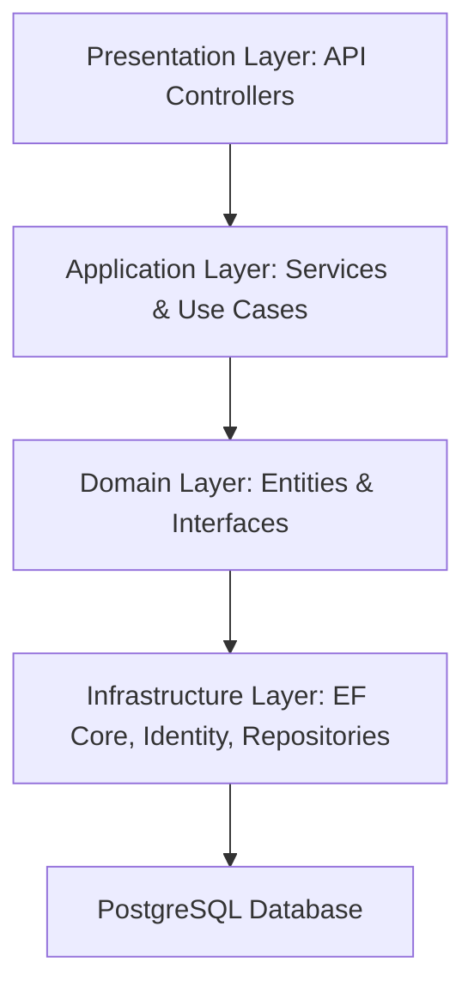

(https://github.com/user-attachments/assets/f2d1a4cb-2e6b-43d9-b111-3d1e68a8af42)# Core Banking Solution

[](https://dotnet.microsoft.com/) 
[](https://learn.microsoft.com/en-us/dotnet/csharp/) 
[](https://www.postgresql.org/)
[](LICENSE)

A **robust backend solution for core banking operations**, built using **ASP.NET Core 8**, **C#**, and **PostgreSQL**, while following the **Clean Architecture** principles. This project demonstrates a modular, maintainable, and secure backend system suitable for financial applications.

---

## Table of Contents

- [Overview](#overview)
- [Project Screenshots](#project-screenshots)
- [Features](#features)  
- [Architecture](#architecture)  
- [Folder Structure](#folder-structure)  
- [Tech Stack](#tech-stack)
- [Live Link](#live-link) 
- [Installation & Setup](#installation--setup)  
- [Database Setup](#database-setup)  
- [API Documentation](#api-documentation)
- [How to Simulate Deposit & Transfer Between Accounts](#how-to-simulate-deposit--transfer-between-accounts)
- [Example Requests & Responses](#example-requests--responses)  
- [Validation & Security](#validation--security)  
- [Contributing](#contributing)  
- [License](#license)  
- [Author](#author)

---

## Overview

The **Core Banking Solution** simulates user account creation, fund transfers, deposits, withdrawals and transaction history with authentication and authorization using ASP.NET Core while following the Clean Architecture Pattern, Microservices and the Repository Pattern.

It demonstrates:

- Clean architecture separation: Domain, Application, Infrastructure, Presentation  
- Secure authentication & authorization with **ASP.NET Core Identity** and **JWT**  
- RESTful APIs 
- Automated validation pipelines and error handling  

---

## Project Screenshots

### Swagger Documentation


###  Credit and Debit Alert 


### 🔄 Transfer Funds (Request and Response)


---

## Features

- **Customer Management:** Register, update, and retrieve customer information  
- **Bank Accounts:** Create and manage accounts per customer  
- **Transactions:** Deposit, withdrawal, transfer, and transaction history  
- **Role-based Access Control:** Admin and Customer roles  
- **Validation Pipeline:** Ensures input validation and domain rules  
- **Security:** Password hashing, JWT authentication, and claims-based authorization  
- **Logging & Auditing:** Tracks critical actions for accountability  

---

## Architecture


---

## Folder Structure
```
CoreBankingSolution/
│
├─ src/
│   ├─ CoreBanking.Domain/           # Entities, Interfaces, Value Objects
│   ├─ CoreBanking.DTO/              # DTOs
│   ├─ CoreBanking.Application/      # Services, Use Cases, CQRS
│   ├─ CoreBanking.Infrastructure/   # EF Core, Repositories, Identity
│   └─ CoreBanking.API/              # Controllers, Program.cs
│
├─ docker/                           # Docker configurations 
└─ README.md
```
---

## Tech Stack
```
• .NET Core (C#)
• Entity Framework Core
• PostgreSQL
• ASP.NET Identity
• JWT Authentication
• Clean Architecture
• Repository Pattern & Dependency Injection
• Command Query Responsibility Segregation (CQRS)
• Unit of Work & Database Transactions
• SendGrid SMTP (for email services) 
```

## Live Link
• Live Link (Swagger Docs): https://core-banking-solution.onrender.com/swagger/index.html <br>

## Installation & Setup

### Prerequisites
Before you begin, make sure you have the following installed:

- [.NET 8 SDK](https://dotnet.microsoft.com/en-us/download/dotnet/8.0)  
- [PostgreSQL](https://www.postgresql.org/download/)  
- [Git](https://git-scm.com/downloads)  

---

### Steps

1. **Clone the repository**

```bash
git clone https://github.com/Yamuhammad01/Core-Banking-Solution.git
```
2. **Restore dependencies**
```bash
dotnet restore

```
2. **Create database migration**
```bash
Add-Migration "InitialCreate"
```
3. **Update Database**
```bash
Update-Database
```
3. **Run the API**
```bash
dotnet run
```
4. **Access API at https://localhost:yourport**

---

## Database Setup
```
• Database: CoreBankingDB
• Tables: AspNetUsers, AspNetUserTokens, AspNetUserRoles, AspNetUserLogins, AspNetUserClaims, AspNetRoles, AspNetRoleClaims, Accounts, Transactions, ConfirmationCodes

```
---
## API Documentation

This section documents all the main endpoints of the Core Banking API, including sample requests, responses, and expected HTTP status codes.

---

### **Endpoints Overview**

| Endpoint                      | Method | Description                     | Status Codes |
|-------------------------------|--------|---------------------------------|--------------|
| `/api/admin/get-all-customers`             | GET    | Get all customers               | 200 OK      |
| `/api/admin/get-customers-by-email`        | GET    | Get customer by Email             | 200 OK, 404 Not Found |
| `/api/admin/deposit`  | POST   | Deposit into an account         | 200 OK, 400 Bad Request |
| `/api/auth/customers/register`             | POST   | Register a new customer           | 201 Created, 400 Bad Request |
| `/api/customer/auth/login`            | POST   | User login & JWT generation     | 200 OK, 400 Bad Request, 401 Unauthorized |
| `/api/transactions/withdraw` | POST   | Withdraw from an account        | 200 OK, 400 Bad Request, 403 Forbidden |
| `/api/transactions/transfer-funds` | POST   | Transfer between accounts       | 200 OK, 400 Bad Request, 403 Forbidden |
| `/api/transactions/transaction-history` | GET   | View transaction history       | 200 OK, 400 Bad Request, 403 Forbidden |


---

## How to Simulate Deposit & Transfer Between Accounts

This section explains how to test **deposit** and **transfer** operations inside the Core Banking Solution using the built-in simulation endpoints. These endpoints are strictly for **development and testing purposes**.

##  Deposit Simulation
### **1. Register a New Customer**
- Submit a registration request.
-  A unique **account number** is automatically generated.
-  Account details are sent to the registered email  
  *(check Spam/Junk if not found)*.

### **2. Log In as Admin**
Use the built-in admin credentials: <br>
• Email: admin@corebanking.com <br>
• Password: Admin@123@$ <br>

After login, a **JWT token** is generated.

### **3. Copy the Token**
Add it to your request (authorisation) header:
Authorization: Bearer <YOUR_JWT_TOKEN> 

### **4. Make a Deposit Request**
Call the `/api/admin/deposit` endpoint using the account number of the customer you registered.

### **5. Check Email Notification**
A **credit alert** is sent to the customer's email showing:
- Amount deposited  
- Updated balance  
- Transaction details  

### **6. Log In as the Customer**
- Use the customer’s email and password. <br>
- copy the generated token and add it to the authorisation header in this format (Bearer eyJhbGciOiJIUzI......)


### **7. Access Account Endpoints**
You can now view:
- Account balance  
- My account  
- Profile information  
- Transaction history  e.t.c
  
  
  ## 🔄 Transfer Between Accounts Simulation

### **1. Create a Second Account**
Register another customer with a different email to generate a second account.

### **2. Initiate a Transfer**
- Log in to the account with funds (Account A).  
- Send a transfer request from **Account A → Account B** using `/api/transactions/transfer-funds`.

### **3. Check Email Alerts**
- **Account A** receives a debit alert.  
- **Account B** receives a credit alert.  

### **4. View Transaction History**
Use the transaction history endpoint to confirm:
- Deposits  
- Transfers  
- Withdrawals  

---

## Important Note

The **deposit endpoint is available only for simulation/testing purposes only**.

In a real-world core banking system:
- Admin deposits should **not exist**  
- Funds should only be added through external bank integrations or real payment rails
- Deposits usually come via ACH, SWIFT, NIP, card transactions, or bank APIs, not through admin-triggered actions.

This simulation exists solely for testing account workflows during development.
 
### **Example Requests & Responses**

#### **1. User Login**

**POST** `/api/auth/login`  
**Headers:**
```http
Content-Type: application/json
{
  "email": "user@example.com",
  "password": "Password123!"
}
```
### **Responses**
```http
Content-Type: application/json
{
  "token": "<JWT_TOKEN>",
  "expiresIn": 3600
}
```
---
## Validation & Security
```
• Passwords hashed using ASP.NET Core Identity
• JWT Authentication & Role-based Authorization

```
---
## Contributing

• Fork the repository  <br>
• Create a feature branch: git checkout -b feature/XYZ..Feature <br>
• Commit your changes: git commit -m "Added xyz... feature" <br>
• Push to branch: git push origin feature/XYZ..Feature <br>
• Open a Pull Request <br>

---
## License

This project is licensed under the MIT License.

---
## Author
Muhammad Idris

• GitHub: https://github.com/Yamuhammad01 <br>
• LinkedIn: https://www.linkedin.com/in/muhammad-idrisb2/ <br>
• Email: idrismuhd814@gmail.com <br>

---
