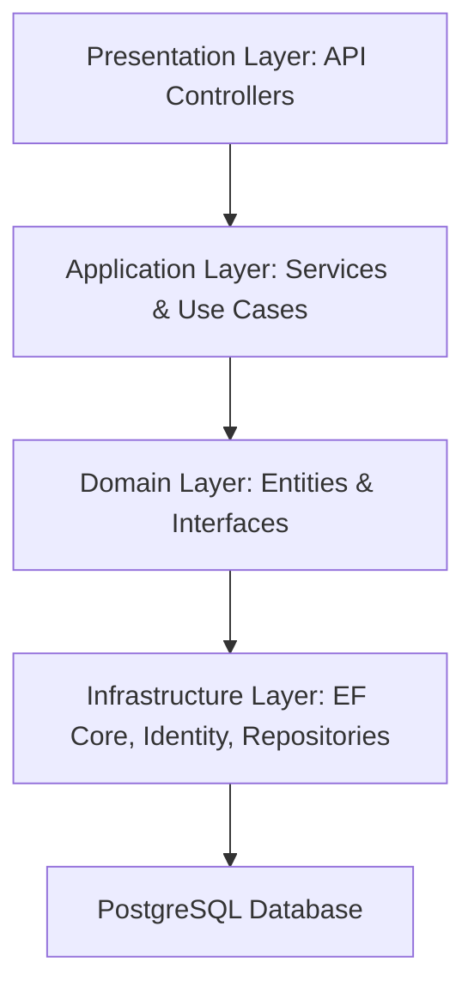

# Core Banking Solution

[](https://dotnet.microsoft.com/) 
[](https://learn.microsoft.com/en-us/dotnet/csharp/) 
[](https://www.postgresql.org/)
[](LICENSE)

A **robust backend solution for core banking operations**, built using **ASP.NET Core 8**, **C#**, and **PostgreSQL**, following the **Clean Architecture** principles. This project demonstrates a modular, maintainable, and secure backend system suitable for financial applications.

---

## Table of Contents

- [Overview](#overview)  
- [Features](#features)  
- [Architecture](#architecture)  
- [Folder Structure](#folder-structure)  
- [Tech Stack](#tech-stack)  
- [Installation & Setup](#installation--setup)  
- [Database Setup](#database-setup)  
- [API Documentation](#api-documentation)  
- [Project Showcase](#project-showcase)  
- [Validation & Security](#validation--security)  
- [Contributing](#contributing)  
- [License](#license)  
- [Author](#author)

---

## Overview

The **Core Banking Solution** backend allows management of banking operations, including customer accounts, transactions, and user roles. It demonstrates:

- Clean architecture separation: Domain, Application, Infrastructure, Presentation  
- Secure authentication & authorization with **ASP.NET Core Identity** and **JWT**  
- RESTful API with HATEOAS support for scalable services  
- Automated validation pipelines and error handling  

---

## Features

- **Customer Management:** Register, update, and retrieve customer information  
- **Bank Accounts:** Create, close, and manage multiple accounts per customer  
- **Transactions:** Deposit, withdrawal, transfer, and transaction history  
- **Role-based Access Control:** Admin, Teller, and Customer roles  
- **Validation Pipeline:** Ensures DRY principles, input validation, and domain rules  
- **Security:** Password hashing, JWT authentication, and claims-based authorization  
- **Logging & Auditing:** Tracks critical actions for accountability  

---

## Architecture


---

## Folder Structure
```
CoreBankingSolution/
│
├─ src/
│   ├─ CoreBanking.Domain/           # Entities, Interfaces, Value Objects
│   ├─ CoreBanking.DTO/              # DTOs
│   ├─ CoreBanking.Application/      # Services, Use Cases, CQRS
│   ├─ CoreBanking.Infrastructure/   # EF Core, Repositories, Identity
│   └─ CoreBanking.API/              # Controllers, Program.cs
│
├─ docker/                           # Docker configurations 
└─ README.md
```
---

## 🧰 Tech Stack Used:
```
• .NET Core (C#)
• Entity Framework Core
• PostgreSQL
• ASP.NET Identity
• JWT Authentication
• Clean Architecture
• Repository Pattern & Dependency Injection
• Command Query Responsibility Segregation (CQRS)
• Unit of Work & Database Transactions
• SendGrid SMTP (for email services) 
```
---

## Installation & Setup

### Prerequisites
Before you begin, make sure you have the following installed:

- [.NET 8 SDK](https://dotnet.microsoft.com/en-us/download/dotnet/8.0)  
- [PostgreSQL](https://www.postgresql.org/download/)  
- [Git](https://git-scm.com/downloads)  

---

### Steps

1. **Clone the repository**

```bash
git clone https://github.com/Yamuhammad01/Core-Banking-Solution.git
```
2. **Restore dependencies**
```bash
dotnet restore

```
2. **Create database migration**
```bash
Add-Migration "InitialCreate"
```
3. **Update Database**
```bash
Update-Database
```
3. **Run the API**
```bash
dotnet run
```
4. **Access API at https://localhost:yourport**

---

## Database Setup
```
• Database: CoreBankingDB
• Tables: Users, Roles, Customers, Accounts, Transactions, ConfirmationCodes

```
---
## API Documentation

This section documents all the main endpoints of the Core Banking API, including sample requests, responses, and expected HTTP status codes.

---

### **Endpoints Overview**

| Endpoint                      | Method | Description                     | Status Codes |
|-------------------------------|--------|---------------------------------|--------------|
| `/api/customers`             | GET    | Get all customers               | 200 OK      |
| `/api/customers/{id}`        | GET    | Get customer by ID              | 200 OK, 404 Not Found |
| `/api/customers`             | POST   | Create a new customer           | 201 Created, 400 Bad Request |
| `/api/accounts`              | POST   | Create a new bank account       | 201 Created, 400 Bad Request |
| `/api/accounts/{id}`         | GET    | Get account details by ID       | 200 OK, 404 Not Found |
| `/api/transactions/deposit`  | POST   | Deposit into an account         | 200 OK, 400 Bad Request |
| `/api/transactions/withdraw` | POST   | Withdraw from an account        | 200 OK, 400 Bad Request, 403 Forbidden |
| `/api/transactions/transfer` | POST   | Transfer between accounts       | 200 OK, 400 Bad Request, 403 Forbidden |
| `/api/auth/login`            | POST   | User login & JWT generation     | 200 OK, 400 Bad Request, 401 Unauthorized |

---

### **Example Requests & Responses**

#### **1. User Login**

**POST** `/api/auth/login`  
**Headers:**
```http
Content-Type: application/json
{
  "email": "user@example.com",
  "password": "Password123!"
}
```
### **Responses**
```http
Content-Type: application/json
{
  "token": "<JWT_TOKEN>",
  "expiresIn": 3600
}
```
---
## Validation & Security
```
• Passwords hashed using ASP.NET Core Identity
• JWT Authentication & Role-based Authorization

```
---
## Contributing
```
• Fork the repository
• Create a feature branch: git checkout -b feature/XYZ..Feature
• Commit your changes: git commit -m "Added xyz... feature"
• Push to branch: git push origin feature/XYZ..Feature
• Open a Pull Request
```
---
## API Documentation

This project is licensed under the MIT License.

---
## Author
Muhammad Idris
```
• GitHub: https://github.com/Yamuhammad01
• LinkedIn: https://www.linkedin.com/in/muhammad-idrisb2/
• Email: idrismuhd814@gmail.com
```
---
